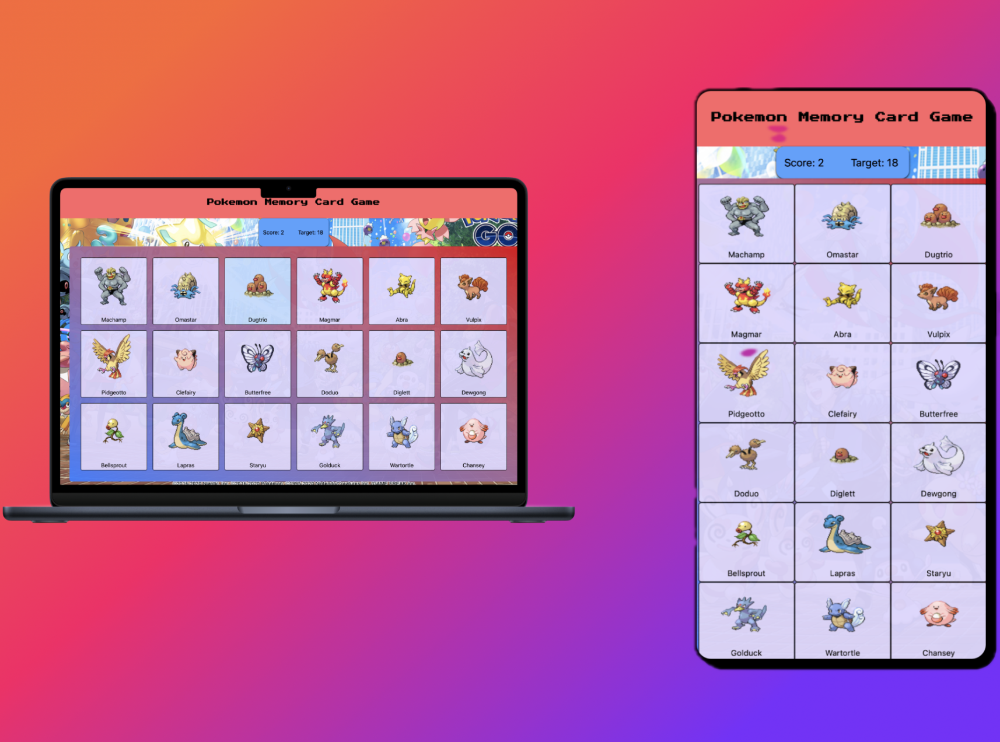

<h1 align='center'>Pokemon Memory Card Game.</h1>



<p align='center'> A Memory Card Game where you must reach a score of 18 to win.</p>

<p align='center'>[Live Demo](https://memory-card-game-leemas.netlify.app)</p>

<h2>Built with</h2>

- React
- Javascript
- Tailwind
- Vite
- Netlify
- Poke API

</br>

<h2>Features</h2>
- In order to win, you must click on every single pokemon only once.
- Automatic shuffling of Gen 1 Pokemon upon win/loss.
- Responsive design.
- Score counter.
</br>


<h2>Development</h2>

Here are the steps to start the project locally.

1. Clone the repository.

```sh
HTTPS - $ git clone https://github.com/leemasdeef/memory-card-game.git
or
SSH - $ git clone git@github.com:leemasdeef/memory-card-game.git
```

2. Move to the cloned directory.

```sh
$ cd memory-card-game
```

3. Install the dependencies.

```sh
$ npm i
or
$ yarn
```

4. Start with pnpm dev OR npm run dev
